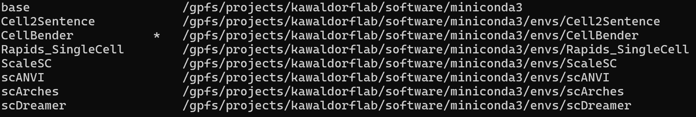

# Reference: Getting Started on Tillicum

This document is a quick-reference companion to [Getting Started with UW Research Computing](https://github.com/taeyunkim03/ENGL396_Software_Documentation.github.io/blob/main/TaskDoc1.md).

---

## Glossary

| Term | Definition |
|---|---|
| **compute node** | The server where your job actually runs. Never run code on the login node. |
| **Conda** | A package and environment manager for Python. Load with `module load conda` before use. |
| **CPU** | General-purpose processor. On Tillicum, each GPU includes 8 CPU cores. CPU-only jobs are not allowed. |
| **debug QoS** | Fastest-allocating QoS level: 30 minutes, 1 GPU. Use for testing before requesting longer sessions. |
| **Duo** | UW's two-factor authentication. Required every time you log into Tillicum or OnDemand. |
| **GPU** | A processor optimized for parallel tasks like machine learning. Tillicum nodes each have 8 NVIDIA H200 GPUs. Every job must request at least 1 GPU. |
| **home directory** | Your personal 10 GB directory. For config files and scripts only. |
| **HPC** | High-Performance Computing. A cluster of powerful servers for jobs too large for a personal computer. |
| **`hyakusage`** | Command to check your Tillicum billing and remaining budget: `hyakusage -u YourUWNetID` |
| **interactive QoS** | Allows up to 8 hours and 2 GPUs. Use for active development work. |
| **login node** | The server you land on after SSH. Use only for submitting jobs and moving files, not computation. |
| **Lolo** | UW's tape-based long-term archive system. Retrieval can take several hours. |
| **`module load`** | Makes pre-installed software available: `module load conda` |
| **NetID** | Your UW username. Used to log in to all UW systems. |
| **normal QoS** | Allows up to 24 hours and 16 GPUs. Use for production batch jobs. |
| **OnDemand** | A browser-based interface for Tillicum — no terminal needed. Supports Jupyter, VS Code, and RStudio. |
| **QoS** | Quality of Service. Defines job limits like wall time and GPU count. Options: `debug`, `interactive`, `normal`. |
| **`salloc`** | SLURM command to request an interactive session on a compute node. |
| **`sbatch`** | SLURM command to submit a batch job script that runs without supervision. |
| **`scancel`** | SLURM command to cancel a job and stop billing: `scancel JOBID` |
| **scratch** | Temporary high-capacity storage. Tillicum scratch is purged after 60 days of inactivity. |
| **SLURM** | The job scheduler used by Hyak and Tillicum. All `s`-prefixed job commands are SLURM commands. |
| **`squeue`** | Shows your active and pending jobs: `squeue -u YourUWNetID` |
| **SSH** | The protocol for connecting to remote servers: `ssh YourUWNetID@tillicum.hyak.uw.edu` |
| **Tillicum** | UW's GPU-accelerated HPC cluster for AI, ML, and data science. Billed at $0.90/GPU-hour. |
| **VPN** | Required for off-campus access. Connect to `uwvpn.washington.edu` using the F5 Big-IP Edge client. |
| **wall time** | The maximum time your job is allowed to run. Set with `--time=HH:MM:SS`. |

---

## Troubleshooting

### Connection

**Problem:** Connection refused or times out.  
**Solution:** Connect to UW VPN first if you are off-campus. Verify the address `tillicum.hyak.uw.edu` and your NetID spelling.

**Problem:** "Host key verification failed."  
**Solution:** Run `ssh-keygen -R tillicum.hyak.uw.edu`, then reconnect and type `yes` when prompted.

**Problem:** Duo authentication not working.  
**Solution:** Ensure your Duo device has network access. Generate a fresh passcode.

---

### Interactive Sessions and OnDemand

**Problem:** `salloc` or OnDemand session stays queued.  
**Solution:** The cluster may be busy. Switch to `--qos=debug`, request fewer resources, or try again during off-peak hours (evenings or weekends).

**Problem:** Session ended unexpectedly.  
**Solution:** Sessions end when the time limit expires. Save work frequently. Use `--qos=interactive` (8 hours) for longer work.

**Problem:** Can't find my Conda environment in Jupyter.  
**Solution:** Register the kernel first, then restart your OnDemand session:
```bash
pip install ipykernel
python -m ipykernel install --user --name=myproject --display-name "My Project"
```



The kernel will show up in the list if registered successfully as above.

---

### Software and Storage

**Problem:** `conda: command not found`.  
**Solution:** Run `module load conda` before using Conda. Add this line to your job scripts.

**Problem:** Running out of home directory space.  
**Solution:** Your home directory is only 10 GB. Move project files to `/gpfs/projects/YourLabName`.

**Problem:** Files disappeared from scratch.  
**Solution:** `/gpfs/scrubbed` files are purged after 60 days of inactivity. Use scratch for temporary files only; move important results to your lab projects directory.

---

### Billing

**Problem:** "Out of budget" error.  
**Solution:** Your lab's Tillicum budget is exhausted. Contact your PI. Check usage with `hyakusage -u YourUWNetID`.

**Problem:** Need to cancel a running job.  
**Solution:** Run `scancel JOBID`. Find the job ID with `squeue -u YourUWNetID`. Cancelling stops billing immediately.

---

**If not solved:** 
Email **help@uw.edu** with "Hyak" in the subject, or attend [weekly office hours](https://calendar.washington.edu/sea_uwit-rc) held by UW-IT Research Computing.
