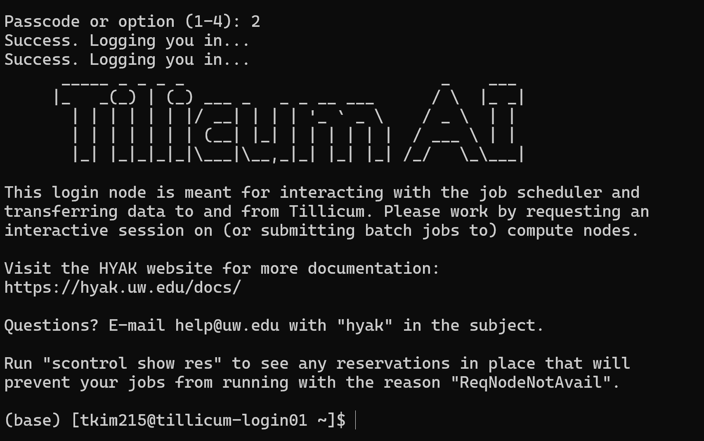

# Getting Started with UW Research Computing

## Audience
This guide is for UW students who are new to high-performance computing through research projects or lab positions. This document assumes basic coding knowledge but no prior HPC experience.

## What You Will Learn
How to connect to Tillicum, start an interactive session, monitor your usage, install software packages, and use the OnDemand web interface.

## Prerequisites
- Active UW NetID with Duo authentication
- Approved Tillicum account
- Terminal access (Windows PowerShell, macOS Terminal, or Linux Terminal)
- VPN access if working off-campus

## Estimated Time
30-45 minutes for initial setup

---

## Task 1: Connecting to Tillicum

### Steps

1. If off-campus, connect to UW VPN first.
   Open F5 Big-IP Edge VPN client, enter `uwvpn.washington.edu`, and authenticate with your UW NetID and Duo.

2. Open your terminal application.

3. Type the SSH connection command.
   ```bash
   ssh YourUWNetID@tillicum.hyak.uw.edu
   ```
   Replace `YourUWNetID` with your actual NetID.

4. Press Enter.

5. If this is your first connection, type `yes` when asked about host authenticity.

6. Enter your UW password (it will not display as you type).

7. Complete Duo authentication when prompted.

**Result**: You see the Tillicum welcome banner and a prompt showing tillicum-login in the hostname.

{width=100 height=200}

8. To disconnect later, type `exit` and press Enter.

---

## Task 2: Starting an Interactive Session

Interactive sessions let you work directly on compute nodes with GPU resources.

### Understanding QoS Levels

Tillicum offers three Quality of Service levels:
- **Debug**: 30 minutes, 1 GPU, for testing
- **Interactive**: 8 hours, 2 GPUs, for development
- **Normal**: 24 hours, 16 GPUs, for production (usually batch jobs)

### Steps

1. Verify you are logged into Tillicum.

2. Type the interactive job request.
   For testing with 1 GPU:
   ```bash
   salloc --qos=debug --gpus=1 --cpus-per-task=8 --mem=200G --time=00:30:00
   ```

   **Command explanation**:
   - `salloc`: Request interactive allocation
   - `--qos=debug`: Use debug level
   - `--gpus=1`: Request 1 GPU
   - `--cpus-per-task=8`: Request 8 CPU cores
   - `--mem=200G`: Request 200 GB memory
   - `--time=00:30:00`: Request 30 minutes

3. Press Enter.

4. Wait for resource allocation.
   You will see messages about your job being queued.

**Result**: When ready, your prompt changes to show a compute node name (like g006) instead of login node.

*[PICTURE NEEDED: Screenshot showing allocation messages and changed prompt]*

5. When finished, type `exit` to end the session and stop billing.

---

## Task 3: Using OnDemand Web Interface

OnDemand provides a browser-based interface for accessing Tillicum without using the terminal. You can launch Jupyter notebooks, RStudio, and other applications directly through your web browser.

### Steps

1. Open your web browser.

2. Navigate to the Tillicum OnDemand portal.
   Visit: https://ondemand.tillicum.hyak.uw.edu
   (For Hyak, use: https://ondemand.hyak.uw.edu)

3. Log in with your UW NetID and complete Duo authentication.

**Result**: You see the OnDemand dashboard.

*[PICTURE NEEDED: Screenshot of OnDemand dashboard homepage]*

4. Launch an interactive application.
   Click "Interactive Apps" in the top menu.
   Select the application you want (e.g., "Jupyter Notebook" or "VS Code").

5. Configure your session.
   Fill in the form:
   - Number of hours: How long you need (e.g., 2)
   - Number of GPUs: Usually 1 for learning
   - Memory (GB): Amount needed (e.g., 64)
   - QoS: Choose debug or interactive
   - Conda environment: Select your environment if you created one

6. Click "Launch" to submit your request.

**Result**: Your session request is queued. You see a card showing "Queued" status.

*[PICTURE NEEDED: Screenshot showing queued session card]*

7. Wait for your session to start.
   The card updates to show "Running" when ready.

8. Click "Connect to Jupyter" (or appropriate button for your application).

**Result**: Your application opens in a new browser tab, running on the compute node.

*[PICTURE NEEDED: Screenshot of Jupyter notebook interface through OnDemand]*

9. When finished, return to the OnDemand dashboard and click "Delete" on your session card to end the session and stop billing.

**Benefits of OnDemand**:
- No terminal commands needed
- Visual file browser for uploading/downloading files
- Easy access to Jupyter notebooks and RStudio
- Graphical interface for those less comfortable with command line

---

## Task 4: Monitoring Your Usage

Track your GPU usage and costs to stay within budget.

### Steps

1. Check your current usage and costs.
   Type:
   ```bash
   hyakusage -u all
   ```

**Result**: The system displays usage by user, usage by QoS level, and budget summary showing dollars used and remaining.

*[PICTURE NEEDED: Screenshot of hyakusage output showing budget breakdown]*

2. Check currently running jobs.
   Type:
   ```bash
   squeue -u YourUWNetID
   ```

**Result**: Shows your active jobs with job ID, status, runtime, and allocated resources.

3. Calculate session costs.
   Formula: Number of GPUs × Hours × $0.90
   Example: 1 GPU for 2 hours = 1 × 2 × $0.90 = $1.80

4. To cancel a job if needed:
   ```bash
   scancel JOBID
   ```
   Replace `JOBID` with the actual job ID from squeue.

---

## Task 5: Installing Software with Conda

Create isolated environments for your Python packages.

### Steps

1. Ensure you have an active interactive session on a compute node.

2. Load the Conda module.
   ```bash
   module load conda
   ```

3. Create a new environment.
   ```bash
   conda create -n myproject python=3.12 -y
   ```
   Replace `myproject` with your chosen name.

**Result**: Conda installs Python and base packages (takes several minutes).

4. Activate your environment.
   ```bash
   conda activate myproject
   ```

**Result**: Your prompt shows the environment name in parentheses.

5. Install packages you need.
   ```bash
   pip install numpy pandas matplotlib
   ```

6. To use in Jupyter notebooks, register the kernel.
   ```bash
   pip install ipykernel
   python -m ipykernel install --user --name=myproject --display-name "My Project"
   ```

**Result**: Your environment appears in Jupyter kernel selection menu when using OnDemand.

7. To deactivate when done:
   ```bash
   conda deactivate
   ```

---

## Task 6: Navigating Directories

Understand where to store your files.

### Tillicum Storage Locations

- **Home**: `/gpfs/home/YourUWNetID` (10 GB, for configuration files)
- **Lab projects**: `/gpfs/projects/YourLabName` (1 TB, for active work)
- **Scratch**: `/gpfs/scrubbed/YourUWNetID` (100 TB, temporary, purged after 60 days)

### Steps

1. Check your current location.
   ```bash
   pwd
   ```

2. Go to your home directory.
   ```bash
   cd ~
   ```

3. Go to your lab directory.
   ```bash
   cd /gpfs/projects/YourLabName
   ```
   Replace `YourLabName` with your actual lab name.

4. List directory contents.
   ```bash
   ls -lh
   ```

**Result**: Shows files with sizes, permissions, and dates.

5. Check disk usage.
   ```bash
   du -sh *
   ```

**Result**: Shows size of each file and folder.

---

## Best Practices

**Close sessions when idle**: GPU hours are billed continuously. Exit when not actively working.

**Start with debug QoS**: Test your code with short sessions before requesting longer time.

**Monitor usage regularly**: Check hyakusage weekly to avoid budget surprises.

**Use OnDemand for learning**: The web interface is easier when you're getting started. Switch to command line as you become more comfortable.

**Use scratch space wisely**: Files in scrubbed are deleted after 60 days of inactivity.

**Save work frequently**: Interactive sessions end when time expires.

---

## Troubleshooting

**Problem**: Connection refused  
**Solution**: Verify VPN is active if off-campus. Check server address spelling.

**Problem**: Job stays pending  
**Solution**: System may be busy. Debug jobs typically allocate fastest. Consider requesting fewer resources.

**Problem**: Out of budget error  
**Solution**: Contact your PI about budget allocation.

**Problem**: OnDemand session won't start  
**Solution**: Check that your account has been activated. Verify you selected valid QoS and resource amounts.

**Problem**: Can't find my Conda environment in Jupyter  
**Solution**: Make sure you registered the kernel with ipykernel install command. Restart your OnDemand session.
