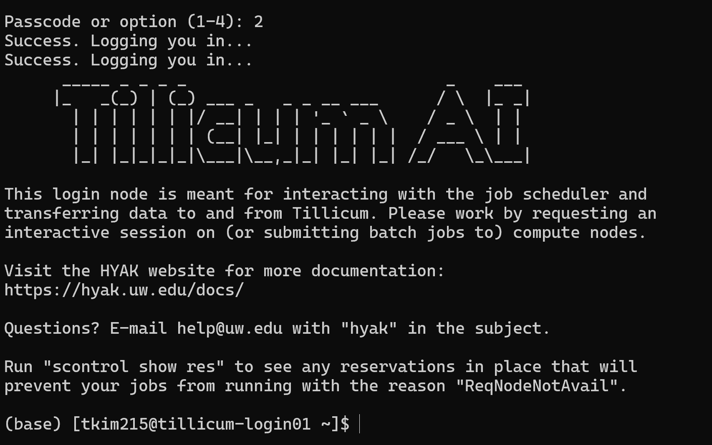
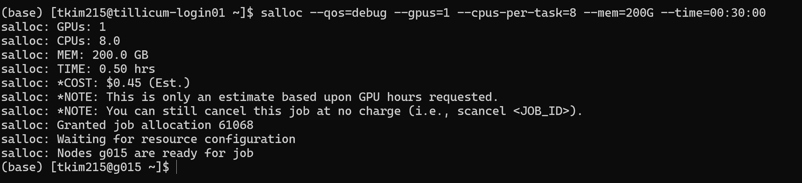
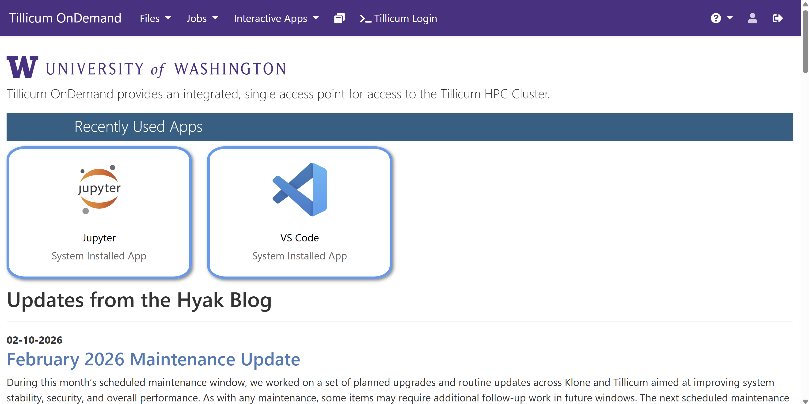
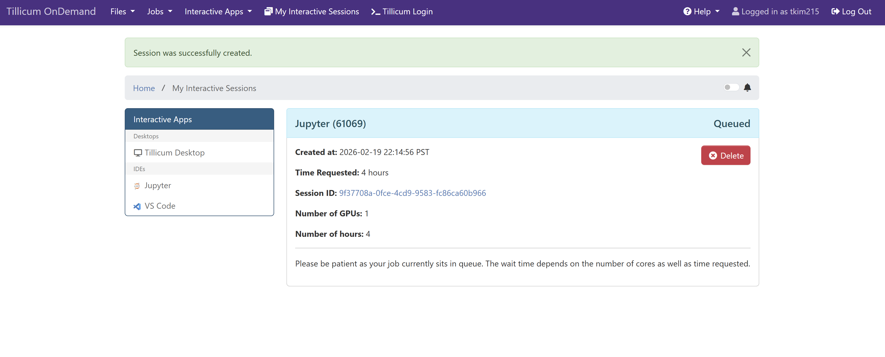
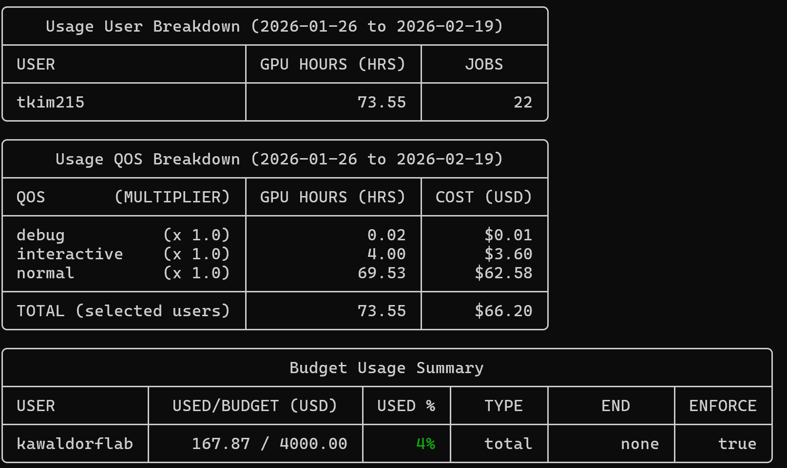

# Getting Started with UW Research Computing

## Audience
This guide is for UW students who are new to high-performance computing through research projects or lab positions. It assumes basic coding knowledge but no prior HPC experience.

## What You Will Learn
In this guide, you will learn how to connect to Tillicum, start an interactive session, monitor your usage, install software packages, and use the OnDemand web interface.

## Prerequisites
- Active UW NetID with Duo authentication
- Approved Tillicum account
- Terminal access (Windows PowerShell, macOS Terminal, or Linux Terminal)
- VPN access if working off-campus

## Estimated Time
30–45 minutes for initial setup

---

## Connecting to Tillicum

### Steps

1. If off-campus, connect to UW VPN first.
   Open F5 Big-IP Edge VPN client, enter `uwvpn.washington.edu`, and authenticate with your UW NetID and Duo.

2. Open your terminal application.

3. Type the SSH connection command.
```bash
   ssh YourUWNetID@tillicum.hyak.uw.edu
```
   Replace *YourUWNetID* with your actual NetID.

4. Press Enter.

5. If this is your first connection, type `yes` when asked about host authenticity.

6. Enter your UW password and press Enter. Your password will not display as you type.

7. Complete Duo authentication when prompted.

**Result**: You see the Tillicum welcome banner and a prompt showing tillicum-login in the hostname.



**Important**: When you are finished, type `exit` and press Enter to disconnect.

---

## Starting a Session

There are two ways to start a working session on Tillicum: using the **terminal** (see [Starting an Interactive Session](#starting-an-interactive-session)) or using the **OnDemand web interface** (see [Using the OnDemand Web Interface](#using-the-ondemand-web-interface)). You only need to do one.

- **Use the terminal** if you are comfortable with the command line or need full control over your resource requests.
- **Use OnDemand** if you prefer a browser-based interface, want to launch Jupyter notebooks or RStudio without terminal commands, or are just getting started and want a visual file browser.

> **Note**: Both options bill GPU hours continuously once your session starts. See [Monitoring Your Usage](#monitoring-your-usage) to understand costs before proceeding.

---

## Starting an Interactive Session

Interactive sessions let you work directly on compute nodes with GPU resources.

### Understanding QoS Levels

Tillicum offers three Quality of Service levels:
- **Debug**: 30 minutes, 1 GPU, for testing
- **Interactive**: 8 hours, 2 GPUs, for development
- **Normal**: 24 hours, 16 GPUs, for production (usually batch jobs)

### Steps

1. Verify you are logged into Tillicum.

2. Type the interactive job request.
   For testing with 1 GPU:
```bash
   salloc --qos=debug --gpus=1 --cpus-per-task=8 --mem=200G --time=00:30:00
```

   **Command explanation**:
   - `salloc`: Request interactive allocation
   - `--qos=debug`: Use debug level
   - `--gpus=1`: Request 1 GPU
   - `--cpus-per-task=8`: Request 8 CPU cores
   - `--mem=200G`: Request 200 GB memory
   - `--time=00:30:00`: Request 30 minutes

3. Press Enter.

4. Wait for resource allocation. You will see messages about your job being queued.

**Result**: When ready, your prompt changes to show a compute node name (like `g006`) instead of the login node.



**Important**: When you are finished, type `exit` to end the session and stop billing.

---

## Using the OnDemand Web Interface

OnDemand provides a browser-based interface for accessing Tillicum without using the terminal. You can launch Jupyter notebooks, RStudio, and other applications directly from your browser — no terminal commands required. It also includes a visual file browser for uploading and downloading files.

### Steps

1. Open your web browser.

2. Navigate to the Tillicum OnDemand portal.
   Visit: https://ondemand.tillicum.hyak.uw.edu
   (For Hyak, use: https://ondemand.hyak.uw.edu)

3. Log in with your UW NetID and complete Duo authentication.

**Result**: You see the OnDemand dashboard.



4. Launch an interactive application.
   Click **Interactive Apps** in the top menu.
   Select the application you want (for example, **Jupyter Notebook** or **VS Code**).

5. Configure your session by filling in the form:
   - **Number of hours**: How long you need (for example, `2`)
   - **Number of GPUs**: Usually `1` for learning
   - **Memory (GB)**: Amount needed (for example, `64`)
   - **QoS**: Choose `debug` or `interactive`
   - **Conda environment**: Select your environment if you have created one (see [Installing Software with Conda](#installing-software-with-conda))

6. Click **Launch** to submit your request.

**Result**: Your session request is queued. You see a card showing **Queued** status.



7. Wait for your session to start. The card updates to show **Running** when ready.

8. Click **Connect to Jupyter** (or the appropriate button for your application).

**Result**: Your application opens in a new browser tab, running on the compute node.

**Important**: When you are finished, return to the OnDemand dashboard and click **Delete** on your session card to end the session and stop billing.

---

## Monitoring Your Usage

Track your GPU usage and costs to stay within budget.

### Steps

1. Check your current usage and costs.
```bash
   hyakusage -u YourUWNetID
```
   Replace *YourUWNetID* with your actual NetID.

**Result**: The system displays usage by user, usage by QoS level, and a budget summary showing dollars used and remaining.



2. Check currently running jobs.
```bash
   squeue -u YourUWNetID
```
   Replace *YourUWNetID* with your actual NetID.

**Result**: Shows your active jobs with job ID, status, runtime, and allocated resources.

3. Calculate session costs.
   Formula: Number of GPUs × Hours × $0.90
   Example: 1 GPU for 2 hours = 1 × 2 × $0.90 = $1.80

4. To cancel a job if needed:
```bash
   scancel JOBID
```
   Replace *JOBID* with the actual job ID from `squeue`.

---

## Installing Software with Conda

Follow these steps only if you need to install custom Python packages or use a specific Python version. If you are using software already available on Tillicum, you can skip this section.

### Steps

1. Ensure you have an active interactive session on a compute node (see [Starting an Interactive Session](#starting-an-interactive-session) or [Using the OnDemand Web Interface](#using-the-ondemand-web-interface)).

2. Load the Conda module.
```bash
   module load conda
```

3. Create a new environment.
```bash
   conda create -n myproject python=3.12 -y
```
   Replace *myproject* with your chosen environment name.

**Result**: Conda installs Python and base packages. This may take several minutes.

4. Activate your environment.
```bash
   conda activate myproject
```

**Result**: Your prompt shows the environment name in parentheses.

5. Install the packages that you need.
```bash
   pip install numpy pandas matplotlib
```

6. To use your environment in Jupyter notebooks, register the kernel.
```bash
   pip install ipykernel
   python -m ipykernel install --user --name=myproject --display-name "My Project"
```
   Replace *myproject* with your environment name and replace *"My Project"* with the display name you want to see in Jupyter.

**Result**: Your environment appears in the Jupyter kernel selection menu when using OnDemand.

7. To deactivate when done:
```bash
   conda deactivate
```

---

## Navigating Directories

Read this section if you are unsure where to store your files or need to understand how Tillicum storage is organized. You do not need to run every command here in order — use the ones relevant to your situation.

### Tillicum Storage Locations

| Location | Path | Quota | Use For |
|---|---|---|---|
| Home | `/gpfs/home/`*YourUWNetID* | 10 GB | Configuration files |
| Lab projects | `/gpfs/projects/`*YourLabName* | 1 TB | Active work |
| Scratch | `/gpfs/scrubbed/`*YourUWNetID* | 100 TB | Temporary files (purged after 60 days) |

### Steps

1. Check your current location.
```bash
   pwd
```

2. Go to your home directory.
```bash
   cd ~
```

3. Go to your lab directory.
```bash
   cd /gpfs/projects/YourLabName
```
   Replace *YourLabName* with your actual lab name.

4. List directory contents.
```bash
   ls -lh
```

**Result**: Shows files with sizes, permissions, and dates.

5. Check disk usage.
```bash
   du -sh *
```

**Result**: Shows the size of each file and folder.

---

## Best Practices

**Close sessions when idle**: GPU hours are billed continuously. Exit when not actively working.

**Start with debug QoS**: Test your code with short sessions before requesting longer time.

**Monitor usage regularly**: Check `hyakusage` weekly to avoid budget surprises.

**Use OnDemand for learning**: The web interface is easier when you are getting started. Switch to the command line as you become more comfortable.

**Use scratch space wisely**: Files in scrubbed are deleted after 60 days of inactivity.

**Save work frequently**: Interactive sessions end when time expires.
