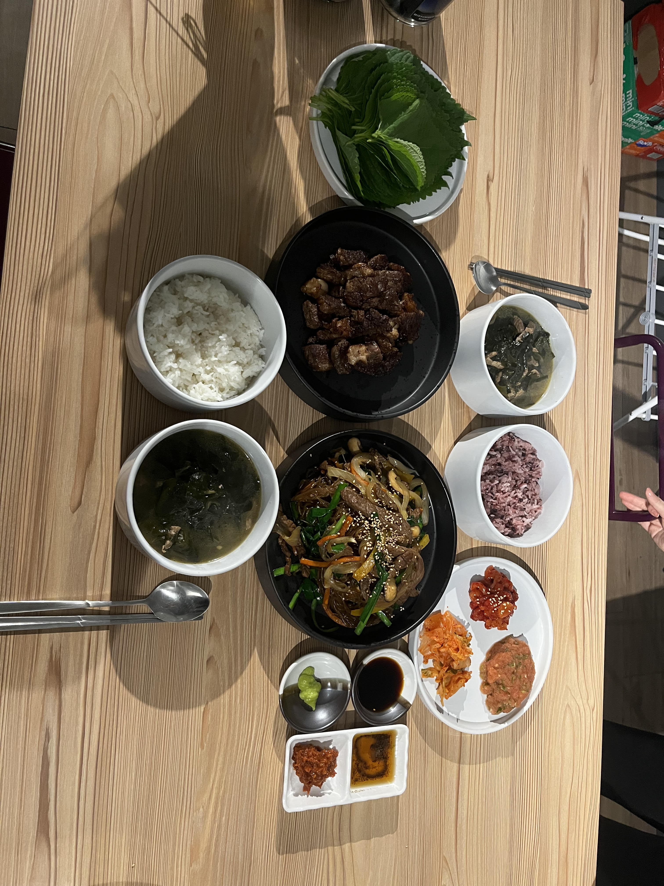

# More About Me

This page says a bit more about me!

---

## Hobbies

I enjoy **cooking** when I have free time. 
Even though I'm not an active person, recently I've been trying to **exercise** more!

### Favorite Korean Food to Cook or Eat
* Korean BBQ
* Bibimbap (Mixed Rice Bowl)
* Tteokbokki (Spicy Rice Cakes)
* Kimchi Stew
* Pajeon (Korean Pancake)

### Korean Restaurants in the Ave
* [The BoB](https://www.google.com/search?q=the+bob&sca_esv=7cc8bad6ea9edbac&rlz=1C1UEAD_enUS977US977&udm=1&biw=1257&bih=663&aic=0&sxsrf=ANbL-n6k9czcjGjMTtLauJSaaZnSFiG6AA%3A1769052109123&ei=zZdxac6iB6eq0PEPmNzqsQc&ved=0ahUKEwiOvbbUmJ6SAxUnFTQIHRiuOnYQ4dUDCBE&uact=5&oq=the+bob&gs_lp=EhZnd3Mtd2l6LW1vZGVsZXNzLWxvY2FsIgd0aGUgYm9iMgUQABiABDIFEAAYgAQyCBAAGIAEGLEDMgUQABiABDIFEAAYgAQyBRAAGIAEMggQABiABBixAzILEAAYgAQYsQMYgwEyBRAAGIAEMgsQABiABBixAxiDAUidCFAAWM0FcAB4AJABAJgBgQGgAaIFqgEDNi4xuAEDyAEA-AEBmAIHoALABcICChAAGIAEGEMYigXCAhAQABiABBixAxhDGIMBGIoFwgIOEAAYgAQYsQMYgwEYigXCAg0QABiABBixAxhDGIoFwgILEAAYgAQYkQIYigWYAwCSBwM0LjOgB8slsgcDNC4zuAfABcIHBTAuMi41yAcWgAgA&sclient=gws-wiz-modeless-local&lqi=Cgd0aGUgYm9iSN68rZLNgoCACFoREAAQARgAGAEiB3RoZSBib2KSARFrb3JlYW5fcmVzdGF1cmFudOABAA#rlimm=16600296480724782315)
* [Kong Tofu House](https://www.google.com/search?q=kong+tofu+house&sca_esv=7cc8bad6ea9edbac&rlz=1C1UEAD_enUS977US977&udm=1&biw=1257&bih=663&aic=0&sxsrf=ANbL-n5QycgP9fk8zmsHPTavs9j7jjhQCw%3A1769052135766&ei=55dxaaXCLuz30PEPt_qeqQI&ved=0ahUKEwjl0ZDhmJ6SAxXsOzQIHTe9JyUQ4dUDCBE&uact=5&oq=kong+tofu+house&gs_lp=EhZnd3Mtd2l6LW1vZGVsZXNzLWxvY2FsIg9rb25nIHRvZnUgaG91c2UyBRAAGIAEMgUQABiABDIFEAAYgAQyBRAAGIAEMgYQABgWGB4yBhAAGBYYHjIGEAAYFhgeMgYQABgWGB4yBhAAGBYYHjIGEAAYFhgeSIscUABYmxtwAHgAkAEAmAFvoAGEC6oBBDEwLjW4AQPIAQD4AQGYAg-gAsALwgIKEAAYgAQYQxiKBcICCxAAGIAEGLEDGIMBwgIIEAAYgAQYsQPCAg4QABiABBixAxiDARiKBcICERAAGIAEGJECGLEDGIMBGIoFwgILEAAYgAQYkQIYigXCAgwQABiABBhDGIoFGArCAg0QABiABBixAxhDGIoFwgIHEAAYgAQYCpgDAJIHAzkuNqAHyFCyBwM5Lja4B8ALwgcGMC4xMC41yAcsgAgA&sclient=gws-wiz-modeless-local)
* [Cafe on the Ave](https://www.google.com/search?q=cafe+on+the+ave&sca_esv=7cc8bad6ea9edbac&rlz=1C1UEAD_enUS977US977&udm=1&biw=1257&bih=663&aic=0&sxsrf=ANbL-n4T2p_SBvQdDoLerAMHRVAf1CgQAg%3A1769052162473&ei=AphxaYrUHNzA0PEPyJaC2A4&oq=cafe+on+&gs_lp=EhZnd3Mtd2l6LW1vZGVsZXNzLWxvY2FsIghjYWZlIG9uICoCCAAyCxAAGIAEGJECGIoFMgUQABiABDILEAAYgAQYkQIYigUyBRAAGIAEMgUQABiABDIFEAAYgAQyBRAAGIAEMgsQABiABBixAxiDATIFEAAYgAQyBRAAGIAESLkSUABYygtwAHgAkAEAmAF2oAHzBaoBAzcuMbgBA8gBAPgBAZgCCKACkgbCAgoQABiABBhDGIoFwgINEAAYgAQYsQMYQxiKBcICCBAAGIAEGLEDwgIQEAAYgAQYsQMYQxiDARiKBcICDhAAGIAEGLEDGIMBGIoFwgIQEAAYgAQYsQMYQxjJAxiKBcICCxAAGIAEGJIDGIoFmAMAkgcDNi4yoAf-K7IHAzYuMrgHkgbCBwUwLjcuMcgHFIAIAA&sclient=gws-wiz-modeless-local)
* [Korean Tofu House](https://www.google.com/search?q=korean+tofu+house&sca_esv=7cc8bad6ea9edbac&rlz=1C1UEAD_enUS977US977&udm=1&biw=1257&bih=663&aic=0&sxsrf=ANbL-n5GoQXAKBSHeBZKfn3592yWtyI0wg%3A1769052178467&ei=EphxaY6kHKen0PEPib6YyAc&ved=0ahUKEwiO9b71mJ6SAxWnEzQIHQkfBnkQ4dUDCBE&uact=5&oq=korean+tofu+house&gs_lp=EhZnd3Mtd2l6LW1vZGVsZXNzLWxvY2FsIhFrb3JlYW4gdG9mdSBob3VzZTIFEAAYgAQyCxAAGIAEGJECGIoFMgUQABiABDIFEAAYgAQyBRAAGIAEMgUQABiABDILEAAYgAQYkQIYigUyBRAAGIAEMgUQABiABDIFEAAYgARIwRBQAFi6D3AAeACQAQCYAXigAf0LqgEEMTMuNLgBA8gBAPgBAZgCEaACuQzCAgoQABiABBhDGIoFwgIIEAAYgAQYsQPCAg4QABiABBixAxiDARiKBcICCxAAGIAEGLEDGIMBwgINEAAYgAQYsQMYQxiKBcICCBAAGIAEGMkDmAMAkgcEMTMuNKAHxGCyBwQxMy40uAe5DMIHBjAuMTYuMcgHKYAIAA&sclient=gws-wiz-modeless-local&lqi=ChFrb3JlYW4gdG9mdSBob3VzZUi9yOywrI-AgAhaKRAAEAEQAhgAGAEYAiIRa29yZWFuIHRvZnUgaG91c2UqCAgCEAAQARACkgERa29yZWFuX3Jlc3RhdXJhbnSaASRDaGREU1VoTk1HOW5TMFZQUTI1eFNraFNiM0ZmTVd0QlJSQULgAQD6AQUIwAEQOQ#rlimm=12517789751951196392)
* [Egg Street](https://www.google.com/search?q=egg+street&sca_esv=7cc8bad6ea9edbac&rlz=1C1UEAD_enUS977US977&udm=1&biw=1257&bih=663&aic=0&sxsrf=ANbL-n6QjgpmnW-p_1wZlDVOKPrRQoN1cw%3A1769052188434&ei=HJhxaeWhGri-0PEPy96OiQ8&ved=0ahUKEwjln5_6mJ6SAxU4HzQIHUuvI_EQ4dUDCBE&uact=5&oq=egg+street&gs_lp=EhZnd3Mtd2l6LW1vZGVsZXNzLWxvY2FsIgplZ2cgc3RyZWV0MgUQABiABDIFEAAYgAQyBRAAGIAEMgUQABiABDIFEAAYgAQyBRAAGIAEMgUQABiABDIFEAAYgAQyBRAAGIAEMgUQABiABEj9DFAAWI0McAB4AJABAJgBe6ABxgeqAQM3LjO4AQPIAQD4AQGYAgqgAu0HwgILEAAYgAQYkQIYigXCAgsQABiABBixAxiDAcICCBAAGIAEGLEDwgIOEAAYgAQYsQMYgwEYigXCAgQQABgDwgIKEAAYgAQYQxiKBcICEBAAGIAEGLEDGEMYgwEYigXCAg0QABiABBixAxhDGIoFwgIHEAAYgAQYCpgDAJIHAzUuNaAH3zOyBwM1LjW4B-0HwgcFMC42LjTIBx2ACAA&sclient=gws-wiz-modeless-local&lqi=CgplZ2cgc3RyZWV0SJ-JkK-KsICACFocEAAQARgAGAEiCmVnZyBzdHJlZXQqBggCEAAQAZIBCnJlc3RhdXJhbnSaAURDaTlEUVVsUlFVTnZaRU5vZEhsalJqbHZUMnMxZEZwdVRtMWxiVkpzVkVWS2RsUkdaRFZpV0d4NVVqQktkVlZWUlJBQuABAPoBBAgiEEc#rlimm=18438488777292096793)

---

## Currently Enrolled Classes

These are the classes I'm taking this quarter:

| Course Number | Course Title |
| :--- | :--- |
| ENGL 396 | Software Documentation |
| CSE 412 | Data Visualization |
| STAT 342 | Probability and Mathematical Statistics III |
| STAT 423 | Applied Regression and Analysis of Variance |

---

## Current Interests
Recently, I started working as a Bioinformatics Research Assistant at UW Medicine. 
Even though I do not have any background knowledge about biology, I became interested in *Bioinformatics* and *Biostatistics*.
If you have any advice regarding **pursuing a master's degree**, I'd be more than happy to hear about it!

**Contact:** [tkim215@uw.edu](mailto:tkim215@uw.edu)
